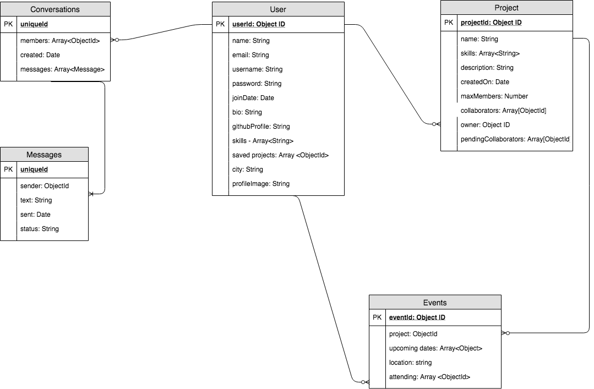

# SocialDev
Users must be registered to have access to this application.

Each user has their profile page that can be accessed once registered. The user can edit their profile with the skills they are interested in learning, their github page, description, or upload a profile image. It's also possible to view other people's profile pages.

Users can browse for projects based on a name, skills, or city.  Users can join projects and chat with others.

# Technologies

# Functional Description

**Description**

**Register**:

* name * required
* username *required
* email *required
* password *required

**Login**: 

Fields to login:

* username  
* password

**Home**

This is where the user can see the projects they have created, the ones they are collaborating in, their saved proejcts, and they are also able to create a new project

**Explore**

This is where users can find projects that others have started. The projects can be searched by name values and filtered by key skills (i.e 'javascript', 'python') and by location

**Project Page**

A user can view additional information of the project and request to collaborate or sign up to meetings.

The project owner has the ability to create new meetings, add/remove collaborators, accept or decline pending collaborators and delete the project

**Profile**

This is the "hub" where the user can see any notifications (pending collaborators, chat messages, upcoming events) in addition to being able to edit their profile for other users to see.

**Chat** 

Users can chat with each other to find out additional information about projects

## Use Case Diagram

# Technical Description

## Blocks Diagram

## Sequence Diagram

## Component Diagram

# Data Model Diagram

